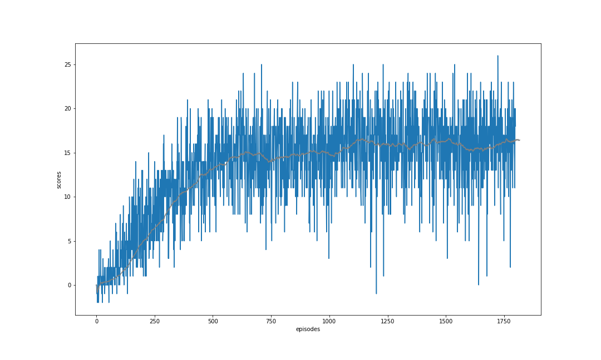
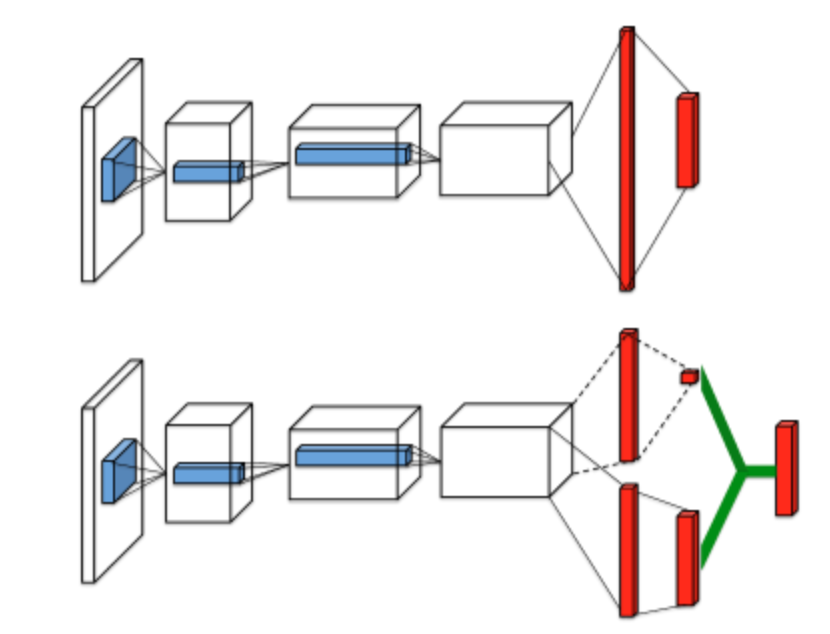
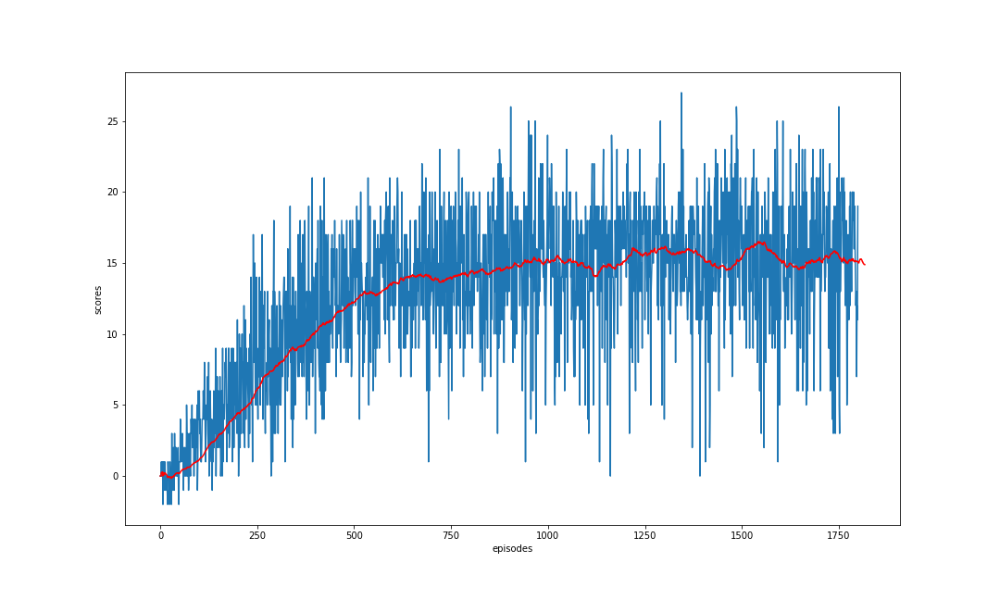
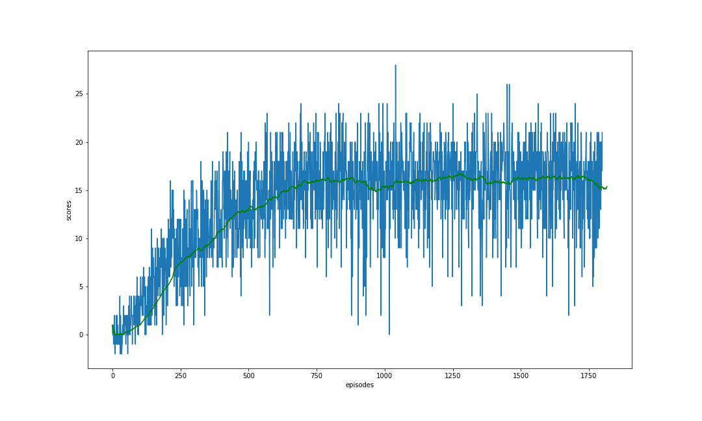
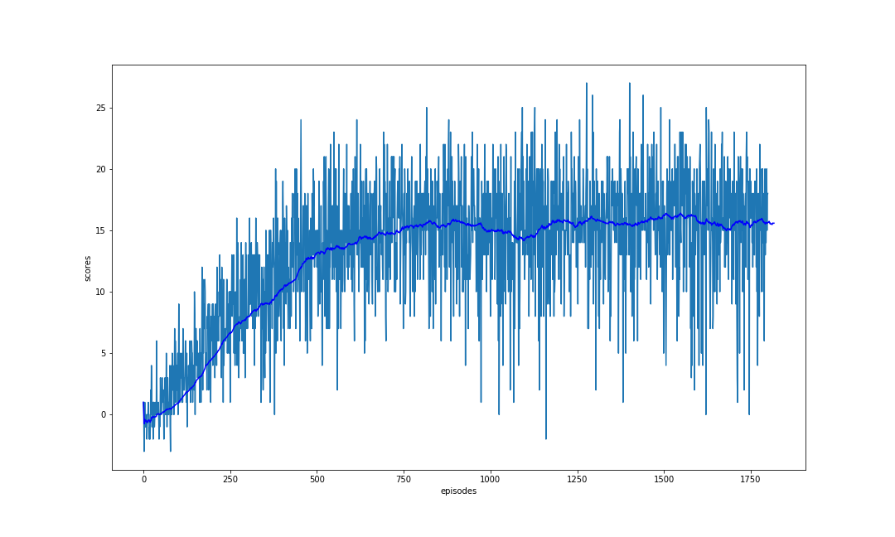
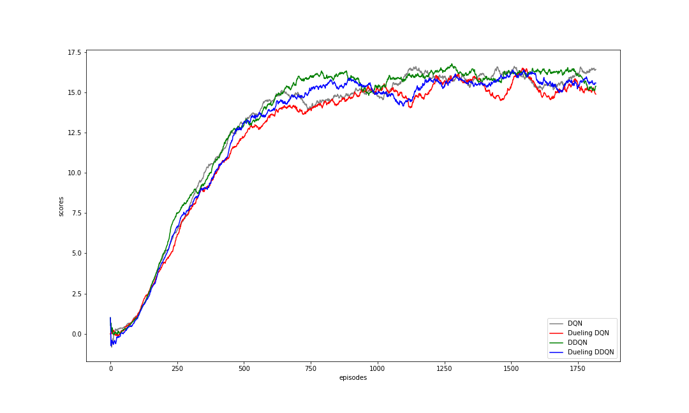

### Project Introduction

For this project, you will train an agent to navigate (and collect bananas!) in a large, square world.  

A reward of +1 is provided for collecting a yellow banana, and a reward of -1 is provided for collecting a blue banana.  Thus, the goal of your agent is to collect as many yellow bananas as possible while avoiding blue bananas.  

The state space has 37 dimensions and contains the agent's velocity, along with ray-based perception of objects around agent's forward direction.  Given this information, the agent has to learn how to best select actions.  Four discrete actions are available, corresponding to:
- **`0`** - move forward.
- **`1`** - move backward.
- **`2`** - turn left.
- **`3`** - turn right.

The task is episodic, and in order to solve the environment, your agent must get an average score of +13 over 100 consecutive episodes.

### Deep Q Network algorithm

refer to the paper Human-level control through deep reinforcement learning [1] 
there are two key points in deep Q-network(DQN):
1. adapt Neural network as non-linear high dimension representation of Agent state in enviroment to address complicated
   world or continous state space problem.
2. experience replay, The replay buffer contains a collection of experience tuples (S, A, R, S'). The tuples are  gradually
   added to the buffer as we are interacting with the environment.The act of sampling a small batch of tuples from the              replay buffer in order to learn is known as experience replay.In addition to breaking harmful correlations, experience 
   replay allows us to learn more from individual tuples multiple times, recall rare occurrences, and in general make better 
   use of our experience.
deep Q-network, that can learn successful policies directly from high-dimensional sensory inputs using end-to-end reinforcement learning.tested this agent on the challenging domain of classic Atari 2600 games 12 . We demon-strate that the deep Q-network agent, receiving only the pixels and the game score as inputs, was able to surpass the performance of all previous algorithms and achieve a level comparable to that of a pro-fessional human games tester across a set of 49 games

### Implementation

Follow the instructions in `Navigation.ipynb` to get started with training my own agent!  

parameters setting for the DQN algorithm:
I set the mini batch to 64, e.g. input 64 states to Q network for training.
replay buffer size to 10K which means use a maximum 10K size memory to keep past frame experience.
GAMMA, discount factor is 0.99
LR, learning rate is 0.0005
UPDATE_EVERY is 4, means he agent sees and selects actions on every 4 frames instead of every frame.
because the game frame update is very fast. but it takes more time to learn from past frame.
epsilon start from init. value 1.0, decrease by decay_rate 0.995 to fixed minimum value 0.005.
so the LR, eps match the GILE requirement. the policy ultimately converge to optimal after enough steps iteration.
I train the model 1800 episodes, for each episodes maximum time step is 1000.

for vanilla DQN model, the final results as below.

the gray curve is average scores per 100 episodes, which value over 13 after 500 episodes iteration.

theoretically, vanilla DQN may over estimate Q values and not stable which has risk of divergence.

there are two improvement method.
double DNQ network, keep 2 DQN network, one is for epsion-greedy policy, another is for target value computation.
apply the technical to aviod over-estimation of Q value.

Dueling DQN network architecture illustrate below.

The dueling network produces separate estimates of the state value function and advantage function.
in practice, the dueling archi-tecture can more quickly identify the correct action during policy evaluation as 
redundant or similar actions are added to the learning problem.

Finally, I put 4 model average scores curve togethter. the figure illustrated below.

### Futher improvements
1. Prioritized Buffer Replay
2. Multi-step Return
3. Noise Net
4. Distributtional Q Learning
5. Rainbow

### References
[1] Human-level control through deep reinforcement learning   
https://www.nature.com/articles/nature14236