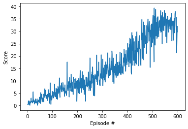
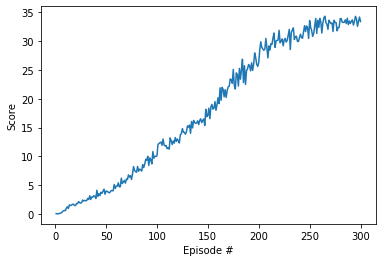

# Project 2: Continuous Control

## first version single Agent implementation

Firstly, I try to implement single version single Agent implementation.
use DDPG(Deep Deterministic Policy Gradient) algorithm to solve the project.

The observation space(states) consists of 33 variables corresponding to position, rotation, velocity, and angular velocities of the arm. Each action is a vector with four numbers, corresponding to torque applicable to two joints. Every entry in the action vector must be a number between -1 and 1.

Actor network structure
2 hidden layers, the first hidden layer has 256 nodes, the 2nd hidden layer has 128 nodes, final output layer has same size of action space.
the 2 hidden layers activation function is relu.
output layer activation function is tanh.
Actor network is used to generate action according to policy(network parameters).

Critic network structure
2 hidden layers ,first hidden layer has 256 nodes, then combined with action from actor network as input of the 2nd hidden layer.
the 2nd hidden layer has 128 nodes, final output layer has 1 node to output estimated value.
the 2 hidden layers activation function is leaky_relu.
output layer don't need activation function.
Critic network is used to evaluate the value of policy

hyperparameters setting
BUFFER_SIZE = int(1e6)  # replay buffer size
BATCH_SIZE = 128        # minibatch size
GAMMA = 0.99            # discount factor
TAU = 1e-2              # for soft update of target parameters
LR_ACTOR = 1e-4         # learning rate of the actor
LR_CRITIC = 1e-4        # learning rate of the critic
WEIGHT_DECAY = 0        # L2 weight decay

the important thing to note:
critic learning rate is same as actor learning rate 1e-4, soft update TAU set to 1e-2 which make the network learn fast.
L2 normalization parameter WEIGHT_DECAY set to 0, otherwise the model can't easily converge in the enviroment.
decay noise sigma every 100 episodes, the decay rate is 0.9.

training results as below, it takes 600 Episodes to reach average score 30+

```
Episode 100	Average Score: 2.50     Score: 5.65
Episode 200	Average Score: 6.77     Score: 7.386
Episode 300	Average Score: 10.03	Score: 10.49
Episode 400	Average Score: 15.31	Score: 22.32
Episode 500	Average Score: 24.61	Score: 25.44
Episode 600	Average Score: 32.50	Score: 29.79
```


## second version Multi Agent implementation
the model network architecture is same as Single Agent. and has same hyper parameters.
20 Agents share experience, every step, add 1 experience tuple to replay buffer. but each Agent explore action and train respectively.
We find that 20 Agents can learn more efficently and stable. only take 300 Episodes to reach average score 30+
```
Episode 100	Average Score: 4.47     Score: 10.08
Episode 200	Average Score: 18.41	Score: 26.29
Episode 300	Average Score: 31.71	Score: 33.43
```


## Consideration & Future Work
1. consider implementation of priority experience replay to better utilize experience. train the model more efficient.
2. due to python program inefficent, it take long time to train 20 Agents. consider parallelism implementation of multi agent later.