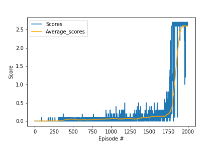

# Project 3: Continuous Control

## implementation

In this environment, two agents control rackets to bounce a ball over a net. If an agent hits the ball over the net, it receives a reward of +0.1. If an agent lets a ball hit the ground or hits the ball out of bounds, it receives a reward of -0.01. Thus, the goal of each agent is to keep the ball in play.

The observation space consists of 8 variables corresponding to the position and velocity of the ball and racket. Two continuous actions are available, corresponding to movement toward (or away from) the net, and jumping.

use DDPG algorithm as baseline.

Actor network structure
2 hidden layers, the first hidden layer has 256 nodes, the 2nd hidden layer has 128 nodes, final output layer has same size of action space.
the 2 hidden layers activation function is relu.
output layer activation function is tanh.
Actor network is used to generate action according to policy(network parameters).

Critic network structure
2 hidden layers ,first hidden layer has 256 nodes, then combined with action from actor network as input of the 2nd hidden layer.
the 2nd hidden layer has 128 nodes, final output layer has 1 node to output estimated value.
the 2 hidden layers activation function is leaky_relu.
output layer don't need activation function.
Critic network is used to evaluate the value of policy

hyperparameters setting
BUFFER_SIZE = int(1e6)  # replay buffer size
BATCH_SIZE = 128        # minibatch size
GAMMA = 1               # discount factor
TAU = 1e-2              # for soft update of target parameters
LR_ACTOR = 1e-4         # learning rate of the actor
LR_CRITIC = 1e-4        # learning rate of the critic
WEIGHT_DECAY = 0        # L2 weight decay

Key note:
1. in the Enviroment, dont need discount for rewards. Set GAMMA to 1.
2. L2 normalization parameter WEIGHT_DECAY set to 0, otherwise the model can't easily converge in the enviroment.
3. I think ONU noise in DDPG is similar to episilon-greedy in DQN. We have to decrease the noise sigma to small enough
   so that the training can converge finally.

training results as below, starting from 1800 Episodes to learn optimal policy and converge to 2.5 - 2.6 around.
the score is in proportion to maximum time step of each Episode.

```
Episode 100	Average Score: 0.00	Score: 0.00
Episode 200	Average Score: 0.00	Score: 0.00
Episode 300	Average Score: 0.01	Score: 0.00
Episode 400	Average Score: 0.04	Score: 0.10
Episode 500	Average Score: 0.05	Score: 0.09
Episode 600	Average Score: 0.03	Score: 0.00
Episode 700	Average Score: 0.03	Score: 0.00
Episode 800	Average Score: 0.05	Score: 0.10
Episode 900	Average Score: 0.05	Score: 0.10
Episode 1000	Average Score: 0.07	Score: 0.20
Episode 1100	Average Score: 0.05	Score: 0.00
Episode 1200	Average Score: 0.07	Score: 0.00
Episode 1300	Average Score: 0.06	Score: 0.20
Episode 1400	Average Score: 0.09	Score: 0.20
Episode 1500	Average Score: 0.10	Score: 0.20
Episode 1600	Average Score: 0.13	Score: 0.40
Episode 1700	Average Score: 0.13	Score: 0.10
Episode 1800	Average Score: 0.46	Score: 2.70
Episode 1900	Average Score: 2.45	Score: 2.20
Episode 2000	Average Score: 2.60	Score: 2.60
```



## Ideas for Future Work
1. consider implementation of priority experience replay to better utilize experience.
2. consider implementation of A3C(Asynchronous advantage actor-critic). A3C take another way to decouple the correlations of state,action pair in sequence.